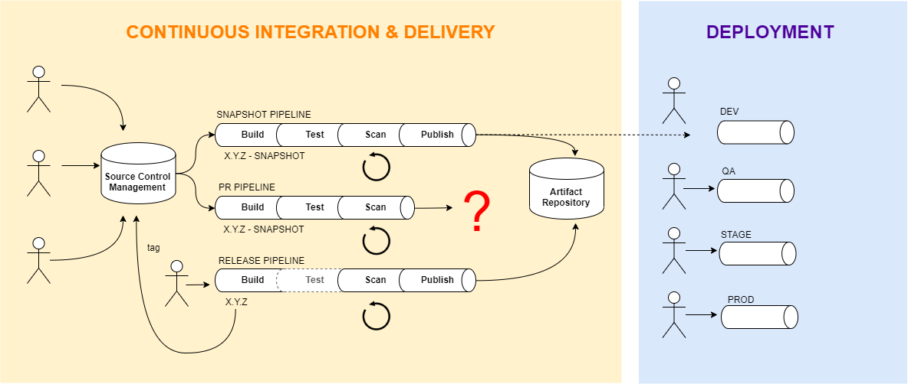

# Jenkins Pipeline Library

Library for Jenkins Pipelines

## Table Of Contents

1. [Purpose](#purpose)
1. [Dependencies](#dependencies)
1. [Installation](#installation)
    1. [Configure Jenkins](#configure-jenkins)
    1. [Configure Each GitHub Organization Inside Jenkins](#configure-each-github-organization-inside-jenkins)
    1. [Configure Integrations](#configure-integrations)
1. [Consumer Requirements](#consumer-requirements)
    1. [Follow Conventions](#follow-conventions)
    1. [Configure Microsoft Teams](#configure-microsoft-teams)
    1. [Configure Pipeline](#configure-pipeline)
    1. [Configure Build Tool](#configure-build-tool)
        1. [Maven](#maven)
    1. [Test Conventions](#test-conventions)
        1. [Java](#java)
1. [Appendix](#appendix)

## Purpose

This pipeline library is the implementation of the Jenkins pipelines that serve all source code repositories that produce:

Either:
- **Library**
  - Continuous Integration
  - Continuous Delivery (publish to binary repository)
  - example: JAR file, TAR.GZ archive, etc.

Or:
- **Application**
  - Continuous Integration
  - Continuous Delivery (publish to binary repository)
  - Deployment
  - example: WAR file, Docker image, etc.

## Dependencies

- **Implement: [Software Versioning & Branching Practices](https://wiki.cgi.com/display/ET/Software+Versioning+%26+Branching+Practices)**
- **Implement: [Binary Repository Layout & Artifact Conventions](https://wiki.cgi.com/display/ET/Binary+Repository+Layout+%26+Artifact+Conventions)**
- **CloudBees Jenkins**
  - Active Directory plugin
  - Blue Ocean plugins
  - DevOptics plugin
  - Config File Provider plugin
  - Pipeline: Multibranch plugin

## Installation

### Configure Jenkins

The following are installations instructions for how to get the Jenkins Pipeline Library setup and running in Jenkins.

In the Jenkins master node:

1. select **Manage Jenkins** / **Configure System**
    1. Global Pipeline Libraries
        1. Library
            1. Name: **`pipeline-library`**
            1. Default version: **`master`**
            1. Allow default version to be overridden: ☑
            1. Include @Library changes in job recent changes: ☑
            1. Retrieval method
                1. Modern SCM
            1. Source Code Management
                1. Git
                    1. Project Repository: **https://gitlab.pipeline.et-apps.net/cgi/jenkins-pipeline-library.git**
                    1. Credentials: *select appropriate credentials*
    1. SonarQube servers
        1. Environment variables: ☑ Enable injection of SonarQube server configuration as build environment variables
        1. SonarQube installations
            1. Name: **`SonarQube`**
            1. Server URL: **https://sonarqube.pipeline.et-apps.net/**
            1. Server authentication token: *generated secret key*
1. select **Manage Jenkins** / **Managed files**
    1. **Add a new Config**
        1. Global Maven settings.xml
            1. ID: **maven-settings-xml**
            1. Name: **Maven settings.xml**
            1. Comment: **Maven settings.xml**
            1. Replace All: **☑**
            1. Add the following settings inside the `settings.xml` file:
                ```xml
                ...
                  <localRepository>${user.home}/.m2/repository-executor-${env.EXECUTOR_NUMBER}/</localRepository>
                ...
                  <interactiveMode>false</interactiveMode>
                ...
                ```
            1. Add the following mirror inside the `settings.xml` file:
                ```xml
                ...
                  <mirrors>
                ...
                    <mirror>
                      <id>mirror-1</id>
                      <name>Mirror - 1</name>
                      <url>https://nexus.pipeline.et-apps.net/repository/maven-all/</url>
                      <mirrorOf>central</mirrorOf>
                    </mirror>
                ...
                  </mirrors>
                ...
                ```
            1. Add the following profile inside the `settings.xml` file:
                ```xml
                ...
                  <profiles>
                ...
                    <profile>
                      <id>sonar-config</id>
                      <activation>
                        <activeByDefault>true</activeByDefault>
                      </activation>
                      <properties>
                        <sonar.login>REPLACE-WITH-GENERATED-SECRET-KEY</sonar.login>
                      </properties>
                    </profile>
                ...
                  </profiles>
                ...
                ```
            1. Server Credentials
                1. ServerId: **`cgi-maven-releases`**
                    1. Credentials: select appropriate credentials
                1. ServerId: **`cgi-maven-snapshots`**
                    1. Credentials: select appropriate credentials
                1. ServerId: **`cgi-scm`**
                    1. Credentials: select appropriate credentials
                1. ServerId: **`nexus.pipeline.et-apps.net`**
                    1. Credentials: select appropriate credentials

### Configure Each GitHub Organization Inside Jenkins

For *each* GitHub organization, follow these steps:
> Note: `cgi` is used as an example GitHub organization for the **Owner** setting

In the Jenkins master node:

1. select **New Item**
    1. Enter an item name: **`cgi-snapshots`**
    1. choose: **GitHub Organization**
    1. click **OK**
    1. Display Name: **`CGI - SNAPSHOTS`**
    1. Projects
        1. GitHub Organization
            1. API endpoint: *select GitHub Enterprise API endpoint*
            1. Credentials: *select appropriate credentials*
            1. Owner: **`cgi`**
            1. Behaviours
                1. Discover branches
                    1. Strategy: **Exclude branch that are also filed as PRs**
                1. Discover pull requests from origin
                    1. Strategy: **Merging the pull request with the current target branch revision**
                1. Discover pull requests from forks
                    1. Strategy: **Merging the pull request with the current target branch revision**
                    1. Trust: **From users with Admin or Write permission**
                1. Add additional behaviour (in the drop-down, under "Within repository" section):
                    1. Filter by name (with regular expression)
                        1. Regular expression: **`^(master|develop|release/.+|hotfix/.+|PR-.+)$`**
        1. Project Recognizers
            1. Remove: Pipeline Jenkinsfile
            1. Add: Custom script
                1. Marker file: **`pipeline.yml`**
                1. Pipeline
                    1. Definition: **Pipeline script from SCM**
                        1. SCM: **Git**
                            1. Repositories
                                1. Repository URL: **https://gitlab.pipeline.et-apps.net/cgi/jenkins-pipeline-library.git**
                                1. Credentials: *select appropriate credentials*
                            1. Branches to build
                                1. Branch Specifier: **`master`**
                        1. Script Path: **`pipelines/integration/Jenkinsfile`**
    1. Scan Organization Triggers
        1. **☑ Periodically if not otherwise run**
            1. Interval: **2 hours**
    1. Orphaned Item Strategy
        1. **☑ Discard old items**
            1. Days to keep old items: **`15`**
            1. Max # of old items to keep: **`15`**
    1. Automatic branch project triggering
        1. Branch names to build automatically: **`.*`**
    1. Click **Save**
1. select **New Item**
    1. Enter an item name: **`cgi-releases`**
    1. choose: **GitHub Organization**
    1. click **OK**
    1. Display Name: **`CGI - RELEASES`**
    1. Projects
        1. GitHub Organization
            1. API endpoint: *select GitHub Enterprise API endpoint*
            1. Credentials: *select appropriate credentials*
            1. Owner: **`cgi`**
            1. Behaviours
                1. Discover branches
                    1. Strategy: **Exclude branch that are also filed as PRs**
                1. Discover pull requests from origin
                    1. Strategy: **Merging the pull request with the current target branch revision**
                1. Discover pull requests from forks
                    1. Strategy: **Merging the pull request with the current target branch revision**
                    1. Trust: **From users with Admin or Write permission**
                1. Add additional behaviour (in the drop-down, under "Within repository" section):
                    1. Filter by name (with regular expression)
                        1. Regular expression: **`^(master|release/.+|hotfix/.+)$`**
        1. Project Recognizers
            1. Remove: Pipeline Jenkinsfile
            1. Add: Custom script
                1. Marker file: **`pipeline.yml`**
                1. Pipeline
                    1. Definition: **Pipeline script from SCM**
                        1. SCM: **Git**
                            1. Repositories
                                1. Repository URL: **https://gitlab.pipeline.et-apps.net/cgi/jenkins-pipeline-library.git**
                                1. Credentials: *select appropriate credentials*
                            1. Branches to build
                                1. Branch Specifier: **`master`**
                        1. Script Path: **`pipelines/integration/Jenkinsfile`**
    1. Scan Organization Triggers
        1. **☑ Periodically if not otherwise run**
            1. Interval: **2 hours**
    1. Orphaned Item Strategy
        1. **☑ Discard old items**
            1. Days to keep old items: **`15`**
            1. Max # of old items to keep: **`15`**
    1. Automatic branch project triggering
        1. Branch names to build automatically: *leave empty*
    1. Click **Save**
1. select **New Item**
    1. Enter an item name: **`cgi-deploy`**
    1. choose: **GitHub Organization**
    1. click **OK**
    1. Display Name: **`CGI - DEPLOY`**
    1. Projects
        1. GitHub Organization
            1. API endpoint: *select GitHub Enterprise API endpoint*
            1. Credentials: *select appropriate credentials*
            1. Owner: **`cgi`**
            1. Behaviours
                1. Discover branches
                    1. Strategy: **All branches**
                    1. Remove behaviour: **Discover pull requests from origin**
                    1. Remove behaviour: **Discover pull requests from forks**
                1. Add additional behaviour (in the drop-down, under "Within repository" section):
                    1. Filter by name (with regular expression)
                        1. Regular expression: **`^(master)$`**
        1. Project Recognizers
            1. Remove: Pipeline Jenkinsfile
            1. Add: Custom script
                1. Marker file: **`pipeline.yml`**
                1. Pipeline
                    1. Definition: **Pipeline script from SCM**
                        1. SCM: **Git**
                            1. Repositories
                                1. Repository URL: **https://gitlab.pipeline.et-apps.net/cgi/jenkins-pipeline-library.git**
                                1. Credentials: *select appropriate credentials*
                            1. Branches to build
                                1. Branch Specifier: **`master`**
                        1. Script Path: **`pipelines/deployment/Jenkinsfile`**
    1. Scan Organization Triggers
        1. **☑ Periodically if not otherwise run**
            1. Interval: **2 hours**
    1. Orphaned Item Strategy
        1. **☑ Discard old items**
            1. Days to keep old items: **`15`**
            1. Max # of old items to keep: **`15`**
    1. Automatic branch project triggering
        1. Branch names to build automatically: *leave empty*
    1. Click **Save**

### Configure Integrations

- GitHub needs to be integrated with JIRA in order to have commit, branch, and pull-request visibility inside JIRA tickets
- Jenkins needs to be integrated with GitHub in order to have Pull Request Decoration (build status) show up in the pull-request view inside GitHub
- SonarQube needs to be integrated with GitHub in order to have Pull Request Decoration (scanning analysis status) show up in the pull-request view inside GitHub
  - https://docs.sonarqube.org/latest/instance-administration/github-application/
- SonarQube Configuration:
  - go to: Administration / Configuration / General
    - set long lived branch regular expression: **`^(master|release/.+|hotfix/.+|tag-.+)$`**

## Consumer Requirements

Any source code repositories that would like to on-board to this pipeline need at least the following:

### Follow Conventions

#### Git Repository Settings

All software source code repositories in GitHub require additional configuration.

On the Git repository page:

1. go to the **Settings** tab
    1. Options
        1. Merge button
            1. ☑ Allow merge commits
            1. ☑ Allow squash commits
            1. ☑ Allow rebase merging
    1. Branches
        1. Branch protection rules, click **Add rule**
            1. Apply rule to: **`master`**
            1. Rule settings
                1. ☑ Require pull request reviews before merging
                    1. ☑ Dismiss stale pull requests approvals when new commits are pushed
                1. ☑ Require status checks to pass before merging
                    1. ☑ Require branches to be up-to-date before merging
    1. Hooks
        1. Webhooks, click **Add webhook**
            1. Payload URL: **https://jenkins.pipeline.et-apps.net/github-webhook/**
            1. Content type: **application/json**
            1. Which events would you like to trigger this webhook?
                1. 🔘 Let me select individual events.
                    1. ☑ Pull Requests
                    1. ☑ Pushes
            1. ☑ Active

#### Software Versioning & Branching Practices

See: [Software Versioning & Branching Practices](https://wiki.cgi.com/display/ET/Software+Versioning+%26+Branching+Practices)

### Configure Microsoft Teams

In order to receive notifications inside your team's group chat, a webhook URL needs to be generated for your corresponding Microsoft Teams channel.

1. go to: https://teams.microsoft.com/
1. go to your team's group chat (channel)
    1. if you do not have one for your team then create one
1. when you hover over the channel name you will see an ellipsis (**•••**) will show up next to the channel name, click on it
1. select **Connectors**
1. search for **Jenkins** and select it
1. enter anything you want for the connection name
1. copy the **Webhook URL** as you will need it later in your pipeline configuration file (**`pipeline.yml`**) below

### Configure Pipeline

A pipeline configuration file (**`pipeline.yml`**) needs to be committed at the root of the Git repository of the application/library that is being on-boarded (replacing **`FILL-ME-IN`** with appropriate values).

`pipeline.yml`:
```yaml
# pipeline config

# Project configuration
project:
  name: "FILL-ME-IN"

# Pipeline Library configuration
pipelineLibrary:
  # Version of the Pipeline Library that you would like to use
  version: "master"

# Build configuration
build:
  # Build language to use for build
  # Note: maps to the language alias defined inside Jenkins: {language.name}-{language.version} (Example: jdk-open-8-212)
  language:
    name: "jdk-open"
    version: "8-242"
  # Build tool to use for build
  # Note: maps to the tool alias defined inside Jenkins: {tool.name}-{tool.version} (Example: maven-3.6)
  tool:
    name: "maven"
    version: "3.6"
    settings: "maven-settings-xml"

# Notification configuration
notification:
  # Microsoft Teams notification
  teams:
    channel:
      # Microsoft Teams channel (webhook URL) to send pipeline success messages to
      # Note: in order to skip this type of notification leave this value blank (empty string: "")
      success: "FILL-ME-IN"
      # Microsoft Teams channel (webhook URL) to send pipeline failure messages to
      # Note: in order to skip this type of notification leave this value blank (empty string: "")
      failure: "FILL-ME-IN"
  # [Optional] Email notification
  email:
    # List of emails to send pipeline success messages to
    success:
      - "first.email@example.com"
      - "second.email@example.com"
      - "etc."
    # List of emails to send pipeline failure messages to
    failure:
      - "first.email@example.com"
      - "second.email@example.com"
      - "etc."

# [Optional] Deploy configuration
# Note: deployment will be skipped if this section is omitted/commented-out
deploy:
  # [Optional] Auto-deploy SNAPSHOT artifact to DEV environment
  autoDeploySnapshot:
    # Branch that auto-deploys will happen from
    # Valid values: { "master" | "release/*" | "hotfix/*" }
    # Default: "master"
    # Note: in order to skip auto-deploys leave this value blank (empty string: "")
    branch: "master"
  # Deployment pattern to use
  # Valid values: { "docker-compose" }
  pattern: "docker-compose"
  # Target group name used by Ansible during deployment
  target: "FILL-ME-IN"
  # Deployment artifact pointer inside artifact repository
  artifact:
    groupId: "FILL-ME-IN"
    artifactId: "FILL-ME-IN"
    # [Optional] only required if artifact has a classifier
    classifier: "config"
    extension: "tar.gz"
  healthcheck:
    # Health-check URL to check once deployment is complete
    url: "http://localhost:####/health"
    # [Optional] Number of attempts to check health-check URL
    # Default: 4
    retry: 3
    # [Optional] Delay (in seconds) to wait in between each attempt at checking the health-check URL
    # Default: 15
    retryInterval: 20
```

### Configure Build Tool

#### Maven

For Maven projects:

> Note: replace `FILL-ME-IN` with appropriate values

Either:

- inherit the POM definitions by referencing the CGI generic parent POM together with SCM and a pointer to the repository:
    `pom.xml`:
    ```xml
    ...
      <parent>
        <groupId>com.cgi</groupId>
        <artifactId>parent-pom</artifactId>
        <version>1</version>
        <!-- # lookup parent from repository -->
        <relativePath />
      </parent>
    ...
      <scm>
        <url>https://gitlab.pipeline.et-apps.net/FILL-ME-IN/FILL-ME-IN</url>
        <connection>scm:git:https://gitlab.pipeline.et-apps.net/FILL-ME-IN/FILL-ME-IN.git</connection>
        <developerConnection>scm:git:https://gitlab.pipeline.et-apps.net/FILL-ME-IN/FILL-ME-IN.git</developerConnection>
        <tag>HEAD</tag>
      </scm>
    ...
      <repositories>
     
        <repository>
          <id>central</id>
          <name>Maven - All</name>
          <url>https://nexus.pipeline.et-apps.net/repository/maven-all/</url>
          <releases>
            <enabled>true</enabled>
          </releases>
          <snapshots>
            <enabled>true</enabled>
          </snapshots>
        </repository>
     
      </repositories>
     
      <pluginRepositories>
     
        <pluginRepository>
          <id>central</id>
          <name>Maven - All</name>
          <url>https://nexus.pipeline.et-apps.net/repository/maven-all/</url>
          <releases>
            <enabled>true</enabled>
          </releases>
          <snapshots>
            <enabled>true</enabled>
          </snapshots>
        </pluginRepository>
     
      </pluginRepositories>
    ...
    ```

Or:

- inherit the POM definitions by referencing the CGI Spring Boot 2 parent POM together with SCM and a pointer to the repository:
    `pom.xml`:
    ```xml
    ...
      <parent>
        <groupId>com.cgi</groupId>
        <artifactId>spring-boot-2-parent-pom</artifactId>
        <version>1</version>
        <!-- # lookup parent from repository -->
        <relativePath />
      </parent>
    ...
      <scm>
        <url>https://gitlab.pipeline.et-apps.net/FILL-ME-IN/FILL-ME-IN</url>
        <connection>scm:git:https://gitlab.pipeline.et-apps.net/FILL-ME-IN/FILL-ME-IN.git</connection>
        <developerConnection>scm:git:https://gitlab.pipeline.et-apps.net/FILL-ME-IN/FILL-ME-IN.git</developerConnection>
        <tag>HEAD</tag>
      </scm>
    ...
      <repositories>
     
        <repository>
          <id>central</id>
          <name>Maven - All</name>
          <url>https://nexus.pipeline.et-apps.net/repository/maven-all/</url>
          <releases>
            <enabled>true</enabled>
          </releases>
          <snapshots>
            <enabled>true</enabled>
          </snapshots>
        </repository>
     
      </repositories>
     
      <pluginRepositories>
     
        <pluginRepository>
          <id>central</id>
          <name>Maven - All</name>
          <url>https://nexus.pipeline.et-apps.net/repository/maven-all/</url>
          <releases>
            <enabled>true</enabled>
          </releases>
          <snapshots>
            <enabled>true</enabled>
          </snapshots>
        </pluginRepository>
     
      </pluginRepositories>
    ...
    ```

### Test Conventions

#### Java

##### Unit Tests

In order for Unit Tests to run correctly and test coverage to be calculated correctly and analyzed in SonarQube, you should be inheriting from one of the parent POMs mentioned above. Unit Tests run in the Maven `test` lifecycle phase. The Maven Surefire Plugin will automatically run all of test classes in the `./src/test/java` directory with the following wildcard patterns:

- `**/Test*.java`
- `**/*Test.java`
- `**/*Tests.java`
- `**/*TestCase.java`

##### Functional Tests

In order for Functional Tests to run correctly and test coverage to be calculated correctly and analyzed in SonarQube, you should be inheriting from one of the parent POMs mentioned above. Functional Tests run in the Maven `integration-test` lifecycle phase. The Maven Failsafe Plugin will automatically run all of test classes in the `./src/test/java` directory with the following wildcard patterns:

- `**/FT*.java`
- `**/*FT.java`
- `**/*FTCase.java`

##### Test Coverage

Inside SonarQube, Unit Tests and Functional Tests will be combined together under the Coverage section, assuming you are properly inheriting from one of the parent POMs mentioned above.

## Appendix

### Standard Pipelines: Continuous Integration & Delivery + Deployment Workflow:


